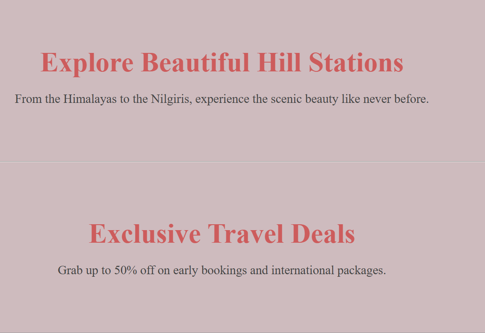
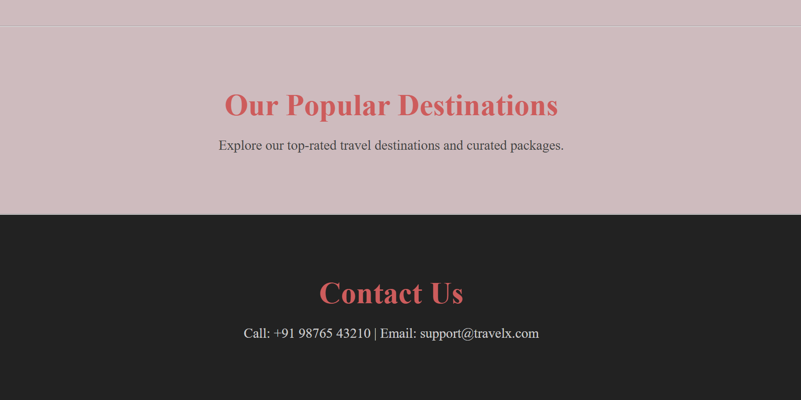

# Oasis_Infobyte_Task1
✨A modern, responsive landing page for Travel-X 🌏 , an international travel agency website. Built with HTML and CSS🎨. and multiple content sections like hill stations, offers, popular sites, and contact details. Ideal for showcasing travel services with elegance and simplicity.

## Features

  🌄 Hill Station highlights
  
  💸 Best travel offers section
  
  📌 Popular destinations section
  
  📞 Contact info section
  
  🖌️ Clean, modern UI with hover effects
  
  🎨 CSS animations and transitions
  
  📱 Fully responsive layout
  
  ⚡ Smooth scroll behavior

  

 # 📌 Technologies Used
  
  ✔️ HTM5L

  ✔️ CSS3 (with custom animations and transitions)

  

   ## 📸 Preview

   

